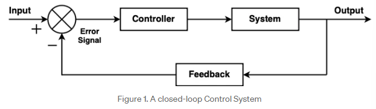
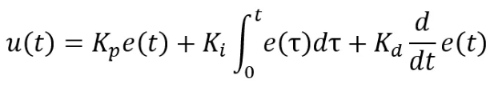
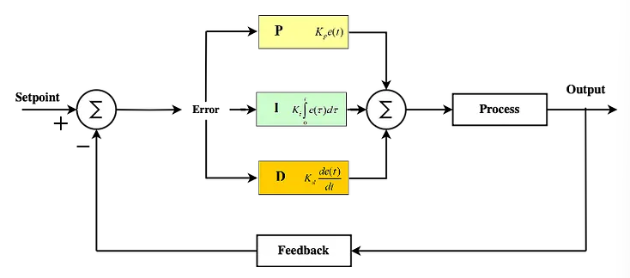

# PID Controller - Crash Course

> **Learning Documentation:** This document provides a comprehensive overview of PID control systemshe

---

## Closed-Loop Control Systems



A closed-loop control system continuously measures the current state, compares it to the desired state, and automatically adjusts the system to reduce the error. This is also called **feedback control**.

---

## PID Controller Overview

### What is a PID Controller?

A Proportional-Integral-Derivative (PID) Controller is a control mechanism that uses three mathematical terms to calculate and correct the error in a system. It's one of the most widely-used control algorithms because it's simple, effective, and works well in many real-world applications.

**Why Use PID?**
- Responsive to current errors (Proportional)
- Eliminates persistent offsets (Integral)
- Anticipates and prevents overshoot (Derivative)

---

## Understanding Each Term

### Proportional (P) Term

**What it does:** Responds to the *current error value*

The proportional term produces an output directly proportional to the error signal. If the error is large, the correction is large. If the error is small, the correction is small.

$$u_P = K_p \cdot e(t)$$

Where:
- $K_p$ = Proportional gain (tuning parameter)
- $e(t)$ = Current error

**Characteristics:**
- ✓ Directly reduces error
- ✓ Faster response with higher $K_p$
- ✗ Slower to reach target
- ✗ May never reach target exactly (steady-state error)
- ✗ Can oscillate if $K_p$ is too high

**Visual Effect:** Stronger push when far from target, weaker push when close

---

### Integral (I) Term

**What it does:** Accumulates past errors over time

The integral term tracks the history of errors. If the error persists (doesn't return to zero), the integral keeps building up and increasing the correction action. This is useful for eliminating steady-state error.

$$u_I = K_i \int_0^t e(\tau) \, d\tau$$

Where:
- $K_i$ = Integral gain (tuning parameter)
- The integral sums up all past errors

**Characteristics:**
- ✓ Eliminates steady-state error
- ✓ Ensures target value is eventually reached
- ✗ Slower response
- ✗ Can cause overshoot if too aggressive
- ✗ Can "wind up" (accumulate excessively) in some situations

**Visual Effect:** Continuous gentle push that increases over time until error is gone

---

### Derivative (D) Term

**What it does:** Predicts future behavior based on rate of change

The derivative term looks at how quickly the error is changing. If the error is decreasing rapidly, it reduces the correction to prevent overshooting the target. If the error is increasing, it provides more aggressive correction.

$$u_D = K_d \frac{de(t)}{dt}$$

Where:
- $K_d$ = Derivative gain (tuning parameter)
- $\frac{de(t)}{dt}$ = Rate of change of error (error slope)

**Characteristics:**
- ✓ Prevents overshoot
- ✓ Makes response smoother
- ✓ Improves stability
- ✗ Amplifies noise in measurements
- ✗ Doesn't affect steady-state error directly

**Visual Effect:** "Braking" effect that slows approach when getting close to target

---

## The PID Formula

### Complete PID Equation

The total PID controller output is the sum of all three terms:

$$u(t) = K_p \cdot e(t) + K_i \int_0^t e(\tau) \, d\tau + K_d \frac{de(t)}{dt}$$






**In Practice:**
The discrete form (used in digital systems like microcontrollers) is:

$$u[n] = K_p \cdot e[n] + K_i \cdot \sum_{i=0}^{n} e[i] + K_d \cdot (e[n] - e[n-1])$$

---

## Tuning Guidelines

### Basic Tuning Method: Ziegler-Nichols (Manual)

Start conservative and gradually increase gains, one at a time:

| Step | Action | Expected Behavior |
|------|--------|------------------|
| 1 | Set $K_i = 0$, $K_d = 0$, increase $K_p$ | System approaches target but oscillates |
| 2 | Increase $K_d$ | Oscillations reduce, response smooths |
| 3 | Increase $K_i$ | Reaches exact target value |

### Tuning Parameters Effect Summary

| Parameter | Effect | Increase → | Decrease → |
|-----------|--------|-----------|-----------|
| $K_p$ (Proportional gain) | Speed of response | Faster, oscillates | Slower, sluggish |
| $K_i$ (Integral gain) | Steady-state error removal | Faster convergence, overshoot | Steady-state offset remains |
| $K_d$ (Derivative gain) | Overshoot prevention | Smoother response, less overshoot | Oscillations increase |

### Practical Starting Points

- **Depth Control (Vertical Profiling Float):** Start with low $K_p$ (buoyancy engines respond slowly), moderate $K_i$ (drift correction), low $K_d$ (pressure sensor noise)
  - Rationale: Depth changes are slow and continuous; syringe movement is gradual; avoid aggressive oscillations that waste energy

---

## Using the PIDController Class

### Implementation Overview

`PIDController` class is a discrete-time implementation which computes a control signal iteratively, meaning we need to call it repeatedly in the main control loop.

### Constructor

```cpp
PIDController(double p, double i, double d, double outMin = -1e9, double outMax = 1e9)
```

**Parameters:**
- `p` = $K_p$ (proportional gain)
- `i` = $K_i$ (integral gain)
- `d` = $K_d$ (derivative gain)
- `outMin` = minimum output limit (default: very negative)
- `outMax` = maximum output limit (default: very positive)

**Example:**
```cpp
// Simple initialization with defaults
PIDController depthControl(0.2, 0.05, 0.1);

// With output limits (syringe range -50 to 50 mL)
PIDController depthControl(0.2, 0.05, 0.1, -50.0, 50.0);
```

### Main Control Loop

In main loop (typically on a timer at fixed intervals), call:

```cpp
double command = depthControl.calculateControlSignal(targetDepth, currentDepth, timeElapsed);
```

**Parameters:**
- `targetDepth` = setpoint (desired depth in meters)
- `currentDepth` = measured depth from pressure sensor
- `timeElapsed` = seconds since last call (e.g., 0.1, 1.0, etc.)

**Returns:** Control signal (syringe displacement command in mL, clamped to min/max limits)

### Complete Example

```cpp
#include "PIDController.h"
#include <ctime>  // whatever time library we use

PIDController depthPID(0.2, 0.05, 0.1);
double targetDepth = 2.5;  // meters

void setup() {
    // limit output to syringe physical range e.g [-50, 50] mL
    depthPID.setOutputLimits(-50.0, 50.0);
    Serial.begin(9600);
}

void loop() {
    static unsigned long lastTime = 0;
    unsigned long now = millis();
    double dt = (now - lastTime) / 1000.0;  // seconds
    lastTime = now;

    if (dt > 0.0) {  // only update if time has passed
        double currentDepth = readPressureSensor();  // sensor read
        double command = depthPID.calculateControlSignal(targetDepth, currentDepth, dt);
        
        // Send command to buoyancy engine
        setSyringeDisplacement(command);  // moves syringe by 'command' mL
        
    }
}
```

---

## Understanding Output Limits (Min/Max)

### What Are Output Limits?

Output limits (also called **saturation limits** or **clamping bounds**) define the range of valid control signals the system can physically execute. For the float, this is the syringe's operating range.

### Why We Need Them

1. **Physical Constraints:** Syringe can only move a certain distance (e.g., 0–50 mL)
2. **Energy Efficiency:** Without limits, the PID might request impossible commands (e.g., 200 mL syringe displacement)
3. **Anti-Windup:** The controller uses saturation detection to prevent integral term buildup

### Setting Min/Max

```cpp
// Define based on syringe specifications
depthPID.setOutputLimits(-50.0, 50.0);  // ±50 mL syringe range
```

**For the float:**
- **Minimum (negative):** How much the syringe can *extend* (float down) → `−[max stroke]`
- **Maximum (positive):** How much the syringe can *compress* (float up) → `+[max stroke]`
- **Units:** Same as the control signal (e.g., mL displacement, servo PWM, stepper steps)

### Example with Different Ranges

```cpp
// Small syringe (10 mL total stroke, symmetric)
depthPID.setOutputLimits(-5.0, 5.0);

// Larger syringe (100 mL, but asymmetric control)
depthPID.setOutputLimits(-50.0, 100.0);  // extend 50, compress 100

// PWM signal (0–255, neutral at 127)
depthPID.setOutputLimits(0.0, 255.0);
```

---

## How to Select Initial Tuning Parameters

### Step 1: Understand The System

Before tuning, gather information:

| Question | How to Find | Example |
|----------|-------------|----------|
| What's the syringe stroke? | Measure or check datasheet | 50 mL |
| What's the pressure sensor range? | Datasheet (e.g., 0–3 bar) | 0–3 bar |
| What depth range do we need? | Mission requirements | 0–2.5 meters |
| How fast does depth change naturally? | Deploy float, measure | ~1 m/s descent rate |
| What's the update frequency? | From loop timing | ~1 Hz (1 second intervals) |

### Step 2: Calculate Initial Kp

Start with a reasonable proportional gain:

$$K_p = \frac{\text{output range}}{\text{expected max error}}
 $$

**Example for float:**
- Output range: 50 mL (syringe stroke)
- Expected max error: 2.5 m (if starting at surface, going to 2.5 m depth)
- $K_p = \frac{50}{2.5} = 20$ mL per meter of error

**Then adjust downward:** Buoyancy engines respond slowly, so use **0.5–0.7× this value** as a starting point.

$$K_p^{\text{start}} = 7.0 \text{ to } 10.0
 $$

### Step 3: Set Ki (Integral Gain)

The integral term handles **steady-state error** (drift). For depth control:

$$K_i^{\text{start}} = 0.01 \text{ to } 0.05
 $$

Start **small** and increase if the float drifts. The integral will accumulate over time and correct the drift without oscillating.

### Step 4: Set Kd (Derivative Gain)

The derivative term prevents overshoot by "braking" as you approach target. For noisy pressure sensors:

$$K_d^{\text{start}} = 0.01 \text{ to } 0.1
 $$

**Keep low** initially because derivative amplifies sensor noise. Increase only if oscillations are a problem.

### Recommended Starting Values for The Float

```cpp
PIDController depthPID(
    8.0,     // Kp: aggressive response for small depth range
    0.5,     // Ki: moderate drift correction
    0.2      // Kd: light braking, noise tolerance
);
depthPID.setOutputLimits(-50.0, 50.0);  // your syringe range
```

**Why higher Kp?** With a small depth range (0–2.5 m), errors are naturally small. Higher Kp is needed to produce meaningful syringe commands. The smaller depth range means faster response overall is acceptable.

---

## Step-by-Step Tuning Procedure

Once the system is running, follow this procedure to optimize performance.

### Phase 1: Proportional-Only Tuning

1. Set `Ki = 0`, `Kd = 0`
2. Increase `Kp` **slowly** until you see oscillations around the target depth
3. **Record the oscillation frequency** (how often it overshoots)
4. Reduce `Kp` by **50%** — this is the baseline

```cpp
// Start with Kp = 1.0, Ki = 0, Kd = 0
// Increase until oscillating: reaches Kp = 16.0
// Baseline: Kp = 8.0
depthPID.setTunings(8.0, 0.0, 0.0);
```

### Phase 2: Add Derivative Damping

1. Start with `Kd = 0.01`
2. Increase **slowly** until oscillations are dampened
3. Stop when float reaches target *smoothly* without overshoot
4. **Don't exceed `Kp / 10`** to avoid noise amplification

```cpp
// Kd increases from 0.1 → 0.5 → 1.0
// Stop when smooth: Kd = 0.8
depthPID.setTunings(8.0, 0.0, 0.8);
```

### Phase 3: Add Integral Correction

1. Start with `Ki = 0.01`
2. After float reaches target, **wait and observe**
3. If it drifts deeper or shallower → increase `Ki` slightly
4. If new oscillations appear → decrease `Ki`
5. Goal: Hold exact depth without oscillation

```cpp
// Tune Ki: start 0.1 → increase to 0.5
// Stop when holding steady: Ki = 0.3
depthPID.setTunings(8.0, 0.3, 0.8);
```

### Phase 4: Fine-Tuning Under Load

Run your float through multiple depth cycles and monitor:

| Observation | Adjustment |
|-------------|------------|
| Overshoots target | ↓ `Kp`, ↑ `Kd`, ↑ `Ki` |
| Undershoots target | ↑ `Kp`, ↓ `Kd` |
| Drifts after reaching | ↑ `Ki` |
| Oscillates slowly | ↓ `Kp`, ↑ `Kd` |
| Oscillates quickly | ↑ `Ki`, filter sensor data |
| Jerky/noisy motion | ↓ `Kd`, add sensor low-pass filter |

### Helper Functions During Tuning

Use `setTunings()` to adjust on the fly:

```cpp
// Change gains without creating new object
depthPID.setTunings(8.5, 0.3, 0.9);

// Reset integral/derivative history when changing setpoint
depthPID.reset();

// Adjust output limits if syringe behavior changes
depthPID.setOutputLimits(-40.0, 60.0);
```

---

## Common Issues & Solutions

### Problem: System Oscillates Around Target
**Likely Cause:** $K_p$ too high

**Solution:** Decrease $K_p$; increase $K_d$ slightly

### Problem: System Reaches Target But Overshoots
**Likely Cause:** Not enough derivative action

**Solution:** Increase $K_d$

### Problem: System Slowly Drifts Away From Target
**Likely Cause:** External disturbance or not enough integral

**Solution:** Increase $K_i$ (carefully, to avoid overshoot)

### Problem: System Sluggish, Takes Forever to Respond
**Likely Cause:** $K_p$ too low

**Solution:** Increase $K_p$

### Problem: Noise Causes Jittery Output
**Likely Cause:** $K_d$ too high (amplifying measurement noise)

**Solution:** Decrease $K_d$; add low-pass filter to sensor readings

---

## Quick Reference Cheat Sheet

| Situation | Adjustment |
|-----------|------------|
| Too slow | ↑ $K_p$ |
| Too fast/oscillates | ↓ $K_p$, ↑ $K_d$ |
| Doesn't reach target | ↑ $K_i$ |
| Overshoots | ↑ $K_d$ or ↓ $K_p$ |
| Noisy/jittery | ↓ $K_d$, filter sensor data |

---

